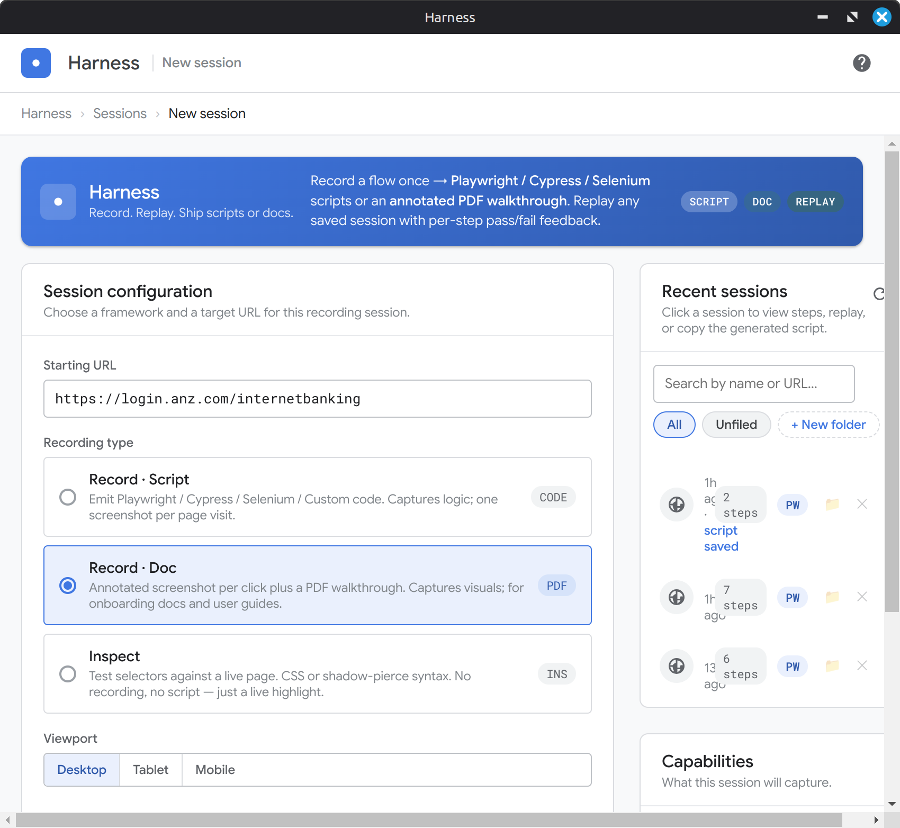

<p align="center">
  
</p>

<h1 align="center">Harness</h1>

<p align="center">
  <strong>Record once. Ship a script or a doc. Replay forever.</strong>
</p>

<p align="center">
  <a href="https://github.com/toolstackhq/harness/stargazers"></a>
  <a href="https://github.com/toolstackhq/harness/commits/main"></a>
  <a href="LICENSE"></a>
</p>

<p align="center">
  <a href="#install">Install</a> •
  <a href="#what-it-does">What it does</a> •
  <a href="#frameworks">Frameworks</a> •
  <a href="#dynamic-values">Dynamic values</a> •
  <a href="#replay">Replay</a> •
  <a href="#folders">Folders</a>
</p>

---



Click around in a real browser. Harness watches via CDP and turns the
session into either a runnable test script or an annotated walkthrough
doc. Replay it whenever you want to check the flow still works.

## What it does

- 📜 **Test scripts.** Playwright, Cypress, Selenium (JavaScript),
  Selenium (Java), or your own custom template.
- 📄 **Walkthroughs.** Per-step screenshots exported as HTML, PDF,
  Markdown, WebM, or MP4 with bullet-list slides per page.
- 🎯 **Element capture.** Hover, click, get just that element shot,
  mark it up with pen / highlighter / shapes / text.
- 🔁 **Replay.** Built-in CDP runner with per-step pass / fail and
  scroll-into-view on every action.
- 🎲 **Dynamic values.** `{{random.email}}`, `{{random.uuid}}`,
  `{{timestamp}}` and friends. Fresh value every replay, baked into
  exported scripts as runtime expressions.
- 📁 **Folders.** Postman-style. Drag a recording onto a folder chip
  to file it. Filter, rename, delete.

## Install

```bash
git clone https://github.com/toolstackhq/harness.git
cd harness
npm install
npm run dev
```

`npm run dev` boots Vite + Electron with hot reload. For a packaged
build:

```bash
npm run build:renderer
npm start
```

Sessions persist under `~/.config/Harness/`.

## Frameworks

| Target | Output | File |
|--------|--------|------|
| Playwright | `await page.locator('#x').fill(EMAIL)` | `*.spec.js` |
| Cypress | `cy.get('#x').clear().type(EMAIL)` | `*.cy.js` |
| Selenium (JavaScript) | `await driver.findElement(By.css('#x')).sendKeys(EMAIL)` | `*.js` |
| Selenium (Java) | `el0.sendKeys(EMAIL);` snippet, no class wrapper | `GeneratedFlow.java` |
| Custom | Your template, your placeholders | anything |

Java target generates the action body only. Driver setup, imports,
and lifecycle stay your job because every machine is different.

## Dynamic values

Click **Insert dynamic value** in the step editor. Pick from the
labelled list. The token gets inserted at the cursor and translated
into runtime code in whatever framework you export.

| Token | Replay value | JS export | Java export |
|-------|--------------|-----------|-------------|
| `{{random.number}}` | `4827193` | `Array.from({length:7},...)` | `String.format("%07d", ThreadLocalRandom...)` |
| `{{random.alpha:8}}` | `qjflxzpr` | inline 26-char picker | `IntStream.range...joining` |
| `{{random.uuid}}` | `f81d4fae-...` | `crypto.randomUUID()` | `UUID.randomUUID().toString()` |
| `{{random.email}}` | `user_<ts>_<n>@example.com` | template literal | string concat |
| `{{timestamp}}` | `1714045932148` | `String(Date.now())` | `String.valueOf(System.currentTimeMillis())` |
| `{{date.iso}}` | `2026-04-27T09:32:12.148Z` | `new Date().toISOString()` | `Instant.now().toString()` |

## Replay

Hit Replay. Harness wipes browser state, navigates to the recorded
URL fresh, then walks every step. Each action scrolls the target
into view, highlights it, fires the real input events. Pass / fail
shows up next to each step in the side panel.

Replay also runs after recording stops without rebooting the
session, so you can record then immediately verify.

## Folders

Drag a session row onto a folder chip. Drop on **Unfiled** to clear
the folder. Click **+ New folder** to add one. Filter by clicking a
chip. The recent-sessions list scrolls when it grows beyond the
session config panel.

## Tests

```bash
npm test
```

61 unit + integration tests across recorder, replay engine, codegen
(all five targets), and locator builder. Run on every commit.

## License

MIT.
